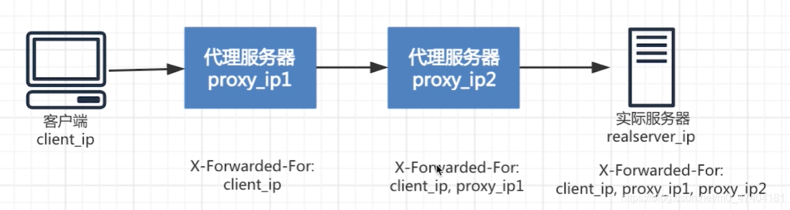

# HTTP

## Basic

### IP Related Headers

* X-Forwarded-For: 记录代理服务器的来源地址，用`,`分割
  * 
* X-Originating-IP: 通常用于电子邮件
* X-Remote-IP: 用于
* X-Remote-Addr
* X-Real-IP: 同样记录来源地址，只有第一层代理记录来源IP

### POST

* POST 文本类型参数，一般使用url-encoded: `Content-Type: application/x-www-form-urlencoded`
* POST参数之间用`&`分隔
* 使用HackBar快速推送